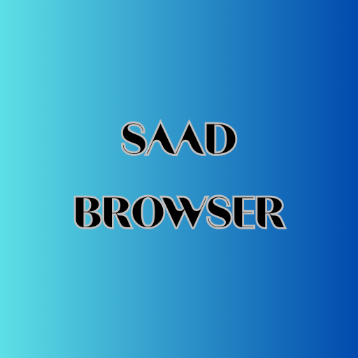
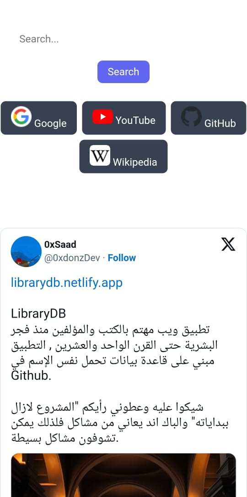
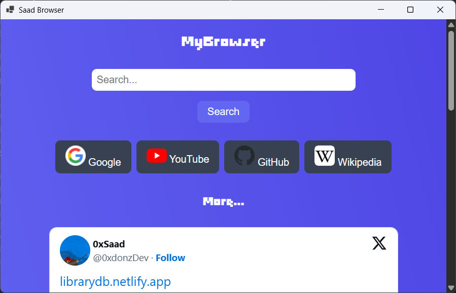
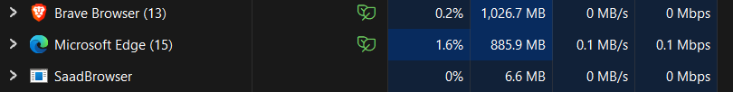

# SaadBrowser
Indie browser working on PC & Android , developed by : 0xSaad / Saad Almalki

 

[Download](https://saadthelegend1.itch.io/saad-browser)
## Notice :
Don't enter any dangerous or suspects websites because security is low in app.

 

لاتدخل أي موقع غير موثوق أو مشتبه به في المتصفح لأنه متصفح ضعيف الحماية حتى تحديث لاحق.

## Project Description
Simple and indie browser any features XD !!!.

### Structure
- **Web** Using `HTML` , `CSS` and `JavaScript`
- **Mobile** app in Android with `Kotlin`
- **Desktop** app was built in Visual Studio and `C# - .NET` Techniques.

#### Screenshots

- Android :

- Windows :

### Simple Feature XD
###### Performance :

### Credits
[0xSaad](https://x.com/0xdonzdev)
