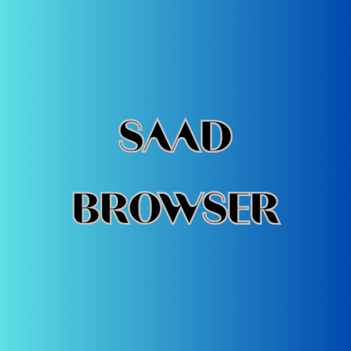

# SaadBrowser
Indie browser working on PC & Android , developed by : 0xSaad / Saad Almalki

### Download

[From Itch.io](https://saadthelegend1.itch.io/saad-browser)

### Disclaimer :
Don't enter any dangerous or suspects websites because security is low in app.

 

إخلاء مسؤولية : لكي لا أُلام مستقبلاً

دخول المواقع الخبيثة بالمتصفح هو مسؤوليتك الشخصية , فأساس الحماية لم يُطور بعد بما في ذلك القائمة السوداء للمواقع المشبوهة

تحميل المتصفح كاملاً على مسؤوليتك

 

Disclaimer: To avoid future liability

Accessing malicious websites through your browser is your sole responsibility, as the browser's security framework, including a blacklist of suspicious sites, is still under development.

Downloading the browser is entirely at your own risk.

### Structure
- **Web** Using `HTML` , `CSS` and `JavaScript`
- **Mobile** app in Android with `Kotlin`
- **Windows** app was built in Visual Studio and `C# - .NET` Techniques.
- **Linux** app based on web with `HTML` , `CSS` , `JavaScript` languages and converted to *.deb* with `C Language`.

#### Credits
[0xSaad](https://x.com/0xdonzdev)
