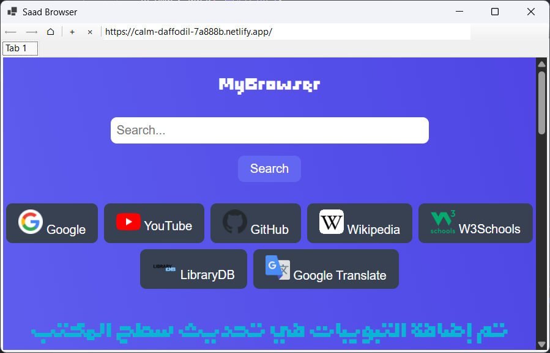
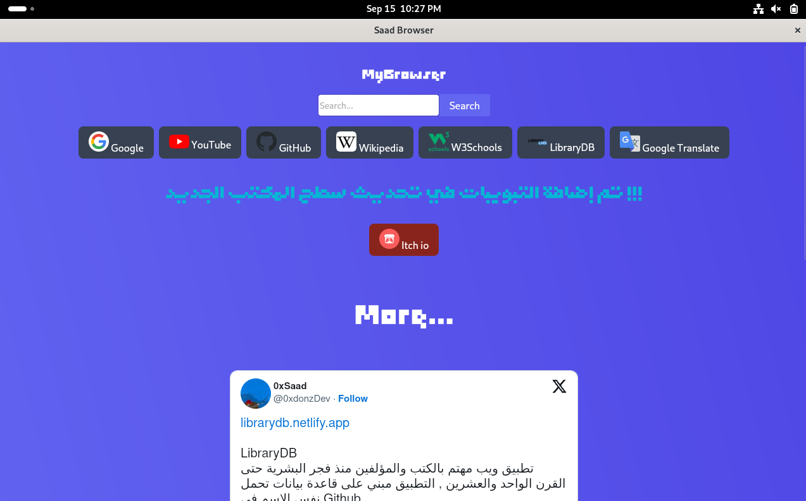
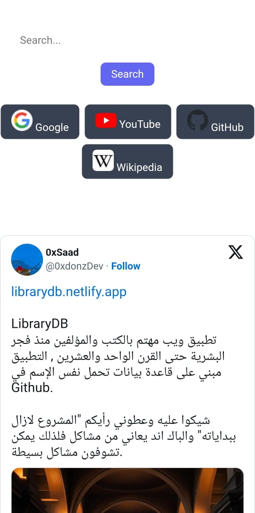

# SaadBrowser
## Project Description
Indie browser working on PC & Android , developed by : 0xSaad / Saad Almalki

#### Download

[From Itch.io](https://saadthelegend1.itch.io/saad-browser)

#### Notice :
Don't enter any dangerous or suspects websites because security is low in app.

 

لاتدخل أي موقع غير موثوق أو مشتبه به في المتصفح لأنه متصفح ضعيف الحماية حتى تحديث لاحق.

### Structure
- **Web** Using `HTML` , `CSS` and `JavaScript`
- **Mobile** app in Android with `Kotlin`
- **Windows** app was built in Visual Studio and `C# - .NET` Techniques.
- **Linux** app based on web with `HTML` , `CSS` , `JavaScript` languages and converted to *.deb* with `C Language`.

#### Screenshots

- Windows :

- Linux :

- Android :

### Credits
[0xSaad](https://x.com/0xdonzdev)
